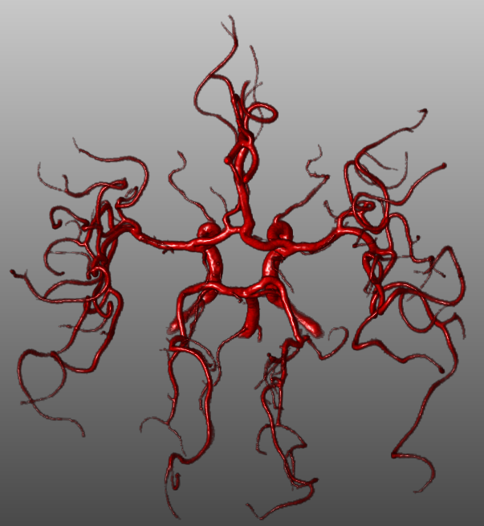
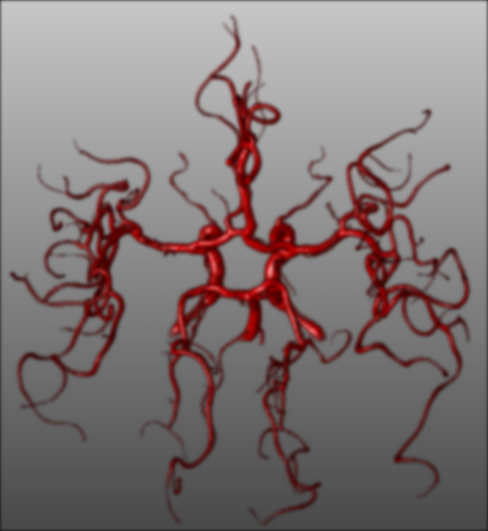

[![License][s1]][li]

[s1]: https://img.shields.io/badge/licence-GPL%203.0-blue.svg
[li]: https://raw.githubusercontent.com/matt77hias/Smoothing/master/LICENSE.txt

# Smoothing
Course Computer Vision: Smoothing

**Academic Year**: 2013-2014 (2nd semester - 1st Master of Science in Engineering: Computer Science)

## About
An implementation of 2D Gaussian smoothing using a separable filter.

## Use

1. Original image
2. Smoothing with own Gaussian filter implementation with border effects
3. Smoothing with own Gaussian filter implementation without border effects
4. Smoothing with OpenCV Gaussian filter implementation without border effects
